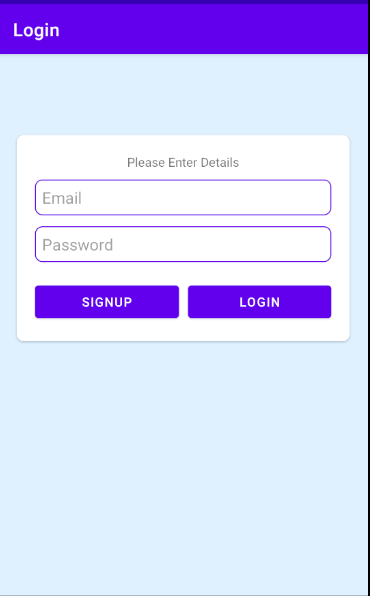
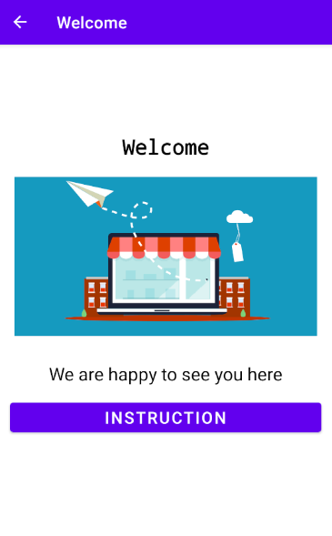
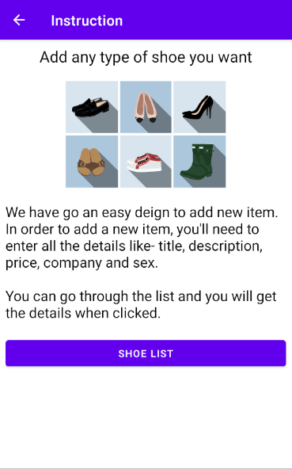
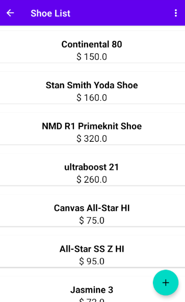
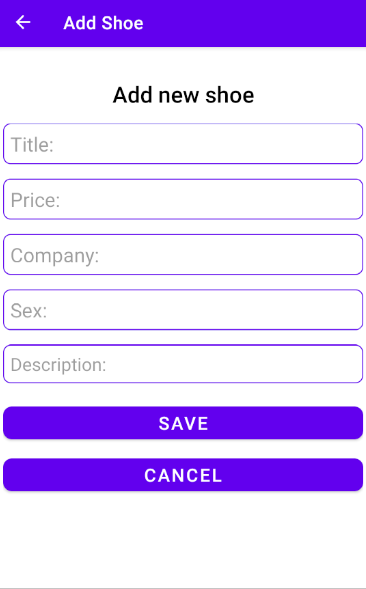

# Shoe Store App
Shoe store app where user can add new item and look through list. In this app, you can see some use of Room, Navigation Component, Data Binding, RecyclerView etc. 

The app has 6 screens:

1. Login 
2. Welcome
3. Instruction
4. Shoe List
5. Add Shoe
6. Shoe Detail
---

## Login Screen 
 
 
 
 The login page uses Firebase.

## Welcome Screen

Same goes for the welcome screen.

## Instruction Screen

Same goes for the instruction screen

## Shoe List Screen

 
 
 Here user can see shoe list. 
  The menu option will give logout option which takes to login screen. 
 When shoe list is clicked then it takes to detail screen where details of shoe are given. 
 When FloatingActionButton is clicked then it takes to add shoe screen.
 
## Add Shoe Screen
 
  
  
  Here user can add new shoe to the list.
